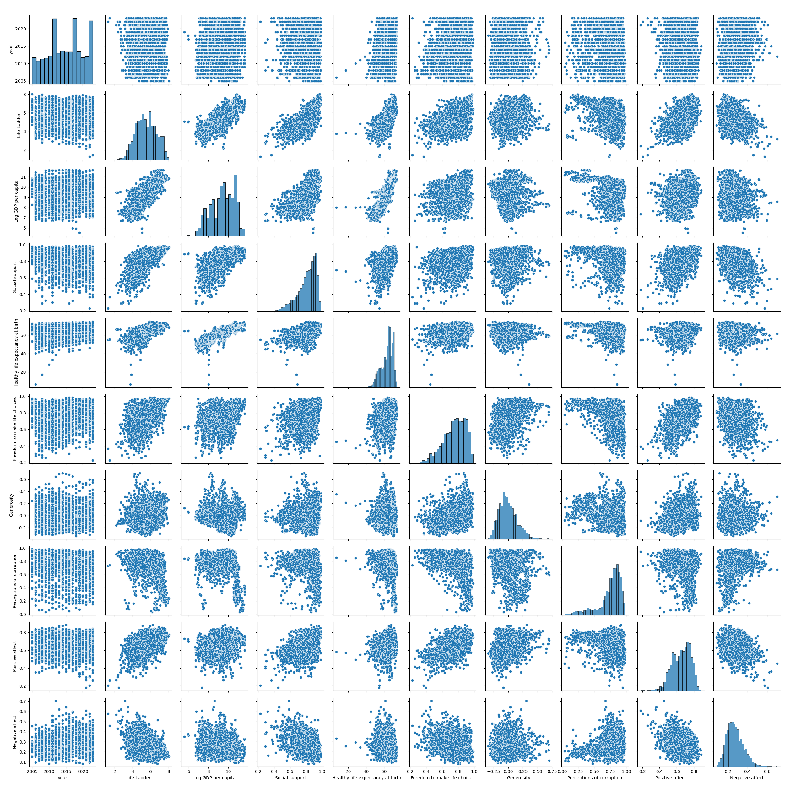

# Analysis Report

## Dataset Overview
The dataset contains the following columns: Country name, year, Life Ladder, Log GDP per capita, Social support, Healthy life expectancy at birth, Freedom to make life choices, Generosity, Perceptions of corruption, Positive affect, Negative affect.

## Key Insights
Based on the analysis, here are the main insights:
The dataset contains information on various factors that contribute to the well-being of individuals in different countries. It includes data on 'Life Ladder', which measures overall life satisfaction; 'Log GDP per capita', which represents economic well-being; 'Social support', which measures the availability of support from family and friends; 'Healthy life expectancy at birth', which indicates the number of years a person can expect to live in good health; 'Freedom to make life choices', which measures the extent of individual autonomy; 'Generosity', which reflects the willingness to help others; 'Perceptions of corruption', which gauges the perception of corruption in society; 'Positive affect', which measures positive emotions such as joy and happiness; and 'Negative affect', which measures negative emotions such as sadness and anger.

The dataset spans a wide range of countries (165) and years (2005-2023), allowing for cross-country and over-time comparisons. It provides a comprehensive overview of factors influencing well-being, enabling researchers and policymakers to identify patterns and relationships between these factors.

From the summary statistics, we can observe that the mean 'Life Ladder' score is around 0.65, indicating a moderate level of overall life satisfaction across the dataset. The mean 'Log GDP per capita' suggests that the countries included in the dataset have diverse economic levels. The mean scores for 'Social support', 'Healthy life expectancy at birth', 'Freedom to make life choices', 'Generosity', and 'Positive affect' are positive, indicating favorable conditions in these areas. The mean 'Perceptions of corruption' and 'Negative affect' scores are relatively low, suggesting that corruption and negative emotions are less prevalent in the countries included in the dataset.

Overall, the dataset offers valuable insights into the factors contributing to well-being and can be used to explore relationships between these factors across countries and over time. It provides a solid foundation for research and policy analysis aimed at improving the well-being of individuals worldwide.

## Implications
These findings suggest the following actions:
 - Further exploration of key variables.
 - Addressing missing values.
 - Implementing suggested analyses.

## Visualizations

